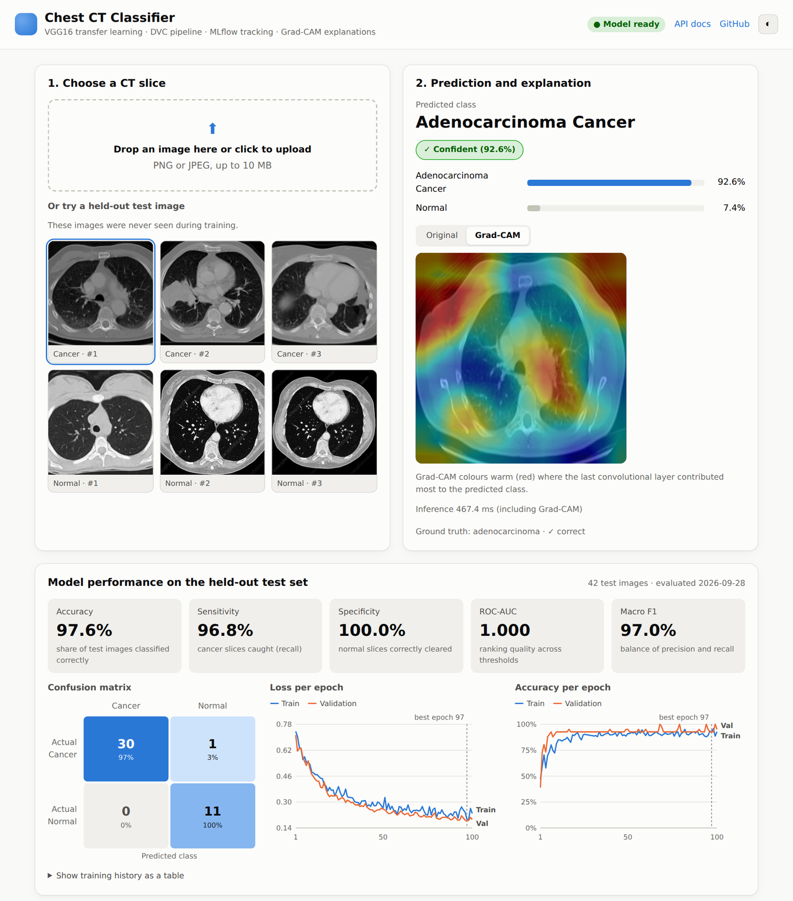
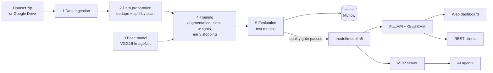

# Chest CT Cancer Classification · MLOps with DVC, MLflow, FastAPI and Grad-CAM

[](https://github.com/14harshaldhote/DeepLearning-Cancer-disease-classification-MLFlow-DVC/actions/workflows/main.yaml)


An end-to-end deep learning project that classifies chest CT slices as **adenocarcinoma** or
**normal** with a VGG16 transfer-learning model. It covers the whole lifecycle: a reproducible
DVC pipeline, MLflow experiment tracking, a quality gate before deployment, a FastAPI service
with Grad-CAM explanations, a web dashboard, an MCP tool for AI agents, tests, CI/CD and Docker.

> Research and portfolio project. Not a medical device. See [MODEL_CARD.md](MODEL_CARD.md).



## Highlights

| Area | What's in the project |
|---|---|
| Data-centric ML | Removes 94 duplicate images and splits by scan ID, so no scan leaks between train, validation and test |
| Explainable AI | Grad-CAM heatmap for every prediction, in the API and the dashboard |
| Human in the loop | Low-confidence predictions are flagged "Needs expert review"; recent predictions are kept as an audit trail |
| MLOps | 5-stage DVC pipeline, MLflow tracking (local or DagsHub), quality gate that only promotes a model that passes |
| Serving | FastAPI with OpenAPI docs, model loaded once at startup, input validation, health check |
| Agentic AI | MCP server so Claude or any MCP client can call the classifier as a tool |
| Engineering | pytest suite, ruff lint, GitHub Actions CI with a Docker smoke test, non-root Docker image |
| Responsible AI | Model card with data issues, limitations and a regulatory note |

## Results on the held-out test set

{{RESULTS_TABLE}}

The earlier version of this repo reported 100% accuracy. That figure came from a validation
split that overlapped the training data and contained duplicate images. The numbers above are
from a leakage-free split; see the [model card](MODEL_CARD.md) for details.

## Architecture



## Quick start

Requires Python 3.10 or 3.11.

```bash
git clone https://github.com/14harshaldhote/DeepLearning-Cancer-disease-classification-MLFlow-DVC.git
cd DeepLearning-Cancer-disease-classification-MLFlow-DVC

python -m venv .venv && source .venv/bin/activate   # or: uv venv && source .venv/bin/activate
pip install -r requirements-dev.txt

uvicorn app:app --port 8080
```

Open http://localhost:8080 for the dashboard and http://localhost:8080/docs for the API.

### Retrain the model

```bash
dvc repro          # runs only the stages whose code, data or params changed
dvc metrics show   # test metrics from scores.json and reports/
mlflow ui          # browse runs logged to ./mlruns
```

Hyperparameters live in [params.yaml](params.yaml) and paths in [config/config.yaml](config/config.yaml).
`python main.py` runs the same five stages without DVC.

To log runs to DagsHub or another MLflow server instead of `./mlruns`, set these environment
variables (never commit the token):

```bash
export MLFLOW_TRACKING_URI=https://dagshub.com/<user>/<repo>.mlflow
export MLFLOW_TRACKING_USERNAME=<user>
export MLFLOW_TRACKING_PASSWORD=<token>
```

### Run with Docker

```bash
docker build -t chest-ct-classifier .
docker run -p 8080:8080 chest-ct-classifier
```

### Tests and lint

```bash
pytest -q
ruff check .
```

## API

| Method | Path | Description |
|---|---|---|
| GET | `/` | Web dashboard |
| GET | `/health` | Liveness and model status |
| POST | `/api/predict` | Multipart image upload; returns label, probabilities, confidence, review flag, Grad-CAM PNG (base64) and latency |
| GET | `/api/model-info` | Parameters, data split, training history and test metrics |
| GET | `/api/samples` | Held-out sample images for the demo |
| GET | `/api/history` | Recent predictions (audit trail, no images stored) |
| POST | `/predict` | Legacy endpoint: `{"image": "<base64>"}` → `[{"image": "<label>"}]` |

```bash
curl -F "file=@static/samples/adenocarcinoma_1.png" "http://localhost:8080/api/predict?explain=false"
```

## Use it from an AI agent (MCP)

`mcp_server.py` exposes two tools, `classify_ct_scan(image_path)` and `model_card()`, over the
Model Context Protocol. For Claude Desktop, add this to `claude_desktop_config.json`:

```json
{
  "mcpServers": {
    "chest-ct": {
      "command": "/path/to/.venv/bin/python",
      "args": ["/path/to/repo/mcp_server.py"]
    }
  }
}
```

For Claude Code: `claude mcp add chest-ct -- /path/to/.venv/bin/python /path/to/repo/mcp_server.py`

## Deploy to AWS (EC2 + ECR)

The `CI/CD` workflow runs lint, tests and a Docker smoke test on every push and pull request.
Deployment runs only when started by hand (Actions → CI/CD → Run workflow → tick *deploy*):

1. Create an IAM user with `AmazonEC2ContainerRegistryFullAccess` and `AmazonEC2FullAccess`.
2. Create an ECR repository and an Ubuntu EC2 instance, and install Docker on it
   (`curl -fsSL https://get.docker.com | sudo sh && sudo usermod -aG docker ubuntu`).
3. Register the EC2 instance as a self-hosted runner (Settings → Actions → Runners).
4. Add repository secrets: `AWS_ACCESS_KEY_ID`, `AWS_SECRET_ACCESS_KEY`, `AWS_REGION`,
   `AWS_ECR_LOGIN_URI`, `ECR_REPOSITORY_NAME`.

## Project structure

```
├── app.py                      FastAPI service and dashboard routes
├── mcp_server.py               MCP tool server for AI agents
├── main.py                     Runs all pipeline stages
├── dvc.yaml / dvc.lock         Pipeline definition and locked versions
├── params.yaml                 Hyperparameters, split ratios, thresholds
├── config/config.yaml          Paths for every stage
├── src/cnnClassifier/
│   ├── components/             Ingestion, preparation, base model, training, evaluation, Grad-CAM
│   ├── pipeline/               One script per DVC stage + prediction pipeline
│   ├── config/ entity/         Typed configuration
│   └── utils/
├── model/model.h5              Served model (promoted by the evaluation stage)
├── reports/                    Data split, training history, test report (tracked by DVC as metrics)
├── templates/ static/          Dashboard (HTML, CSS, JS, sample images)
├── tests/                      pytest suite
├── research/                   Original notebooks and the dataset zip
└── MODEL_CARD.md
```

## Tech stack

TensorFlow/Keras · DVC · MLflow · FastAPI · Uvicorn · Grad-CAM · MCP · pytest · ruff · Docker · GitHub Actions · AWS ECR/EC2

## License

MIT
